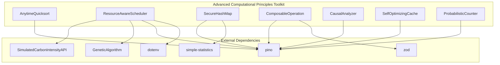
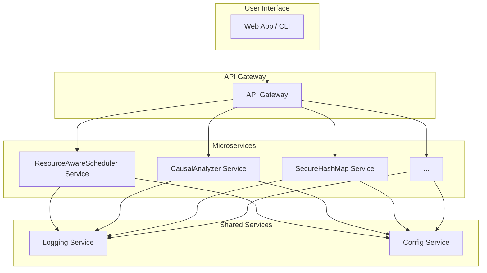

# Architectural Diagram

## Data Flow: CausalAnalyzer

1. **Input:**
   - `data`: An array of objects representing the dataset.
   - `independentVar`: The name of the independent variable.
   - `dependentVar`: The name of the dependent variable.
   - `confoundingVar`: The name of the confounding variable.

2. **Process:**
   - The `CausalAnalyzer` calculates the overall trend of the dependent variable with respect to the independent variable.
   - It then segments the data by the confounding variable and calculates the trend within each segment.
   - Finally, it compares the overall trend with the segmented trends to detect Simpson's Paradox.

3. **Output:**
   - An object containing:
     - `overallTrend`: The calculated trend for the entire dataset.
     - `segmentedTrends`: An object with the trends for each segment.
     - `paradox`: A boolean indicating whether a paradox was detected.

## Proposed Microservice Architecture

In this architecture, each of the core computational principles would be extracted into its own microservice. An API Gateway would provide a single entry point for all requests, and shared services like logging and configuration would be used by all the microservices.
