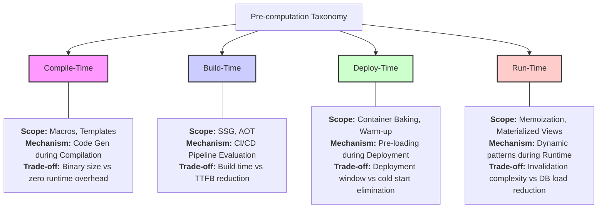

# Pre-computation Logic Visualizations

This document provides visual and tabular representations of the pre-computation strategies defined in `docs/PRECOMPUTATION_LOGIC.json`.

## 1. Decision Matrix Table

To determine if a piece of logic should be pre-computed, use the following scoring weights and formula.

**Efficiency Formula:** `Efficiency = (Freq_Read * Cost_Read) - (Freq_Write * Cost_Write)`

| Metric | Weight | Optimal Condition | Description |
| :--- | :--- | :--- | :--- |
| **Read/Write Ratio** | 0.45 | > 50:1 | High read-to-write ratio indicates that pre-computation work is amortized over many reads. |
| **Data Volatility (TTL)** | 0.30 | > 300s | Longer TTLs reduce the frequency of re-computation due to invalidation. |
| **Compute Cost Per Unit** | 0.25 | > 100ms | Expensive compute tasks (e.g., aggregations, ML inference) yield higher ROI when memoized. |

### Decision Thresholds
- **Score > 0.75**: Pre-compute
- **Score 0.30 - 0.75**: Lazy-Compute
- **Score < 0.30**: On-Demand

---

## 2. Pre-computation Taxonomy Map

The following diagram illustrates the different scopes of pre-computation within the system lifecycle.

